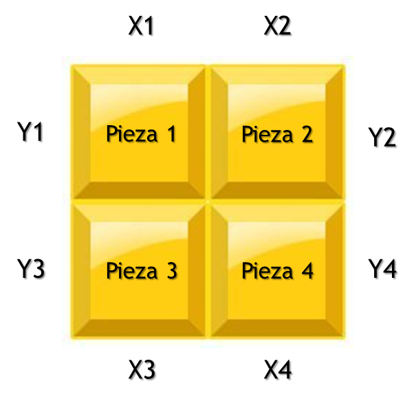
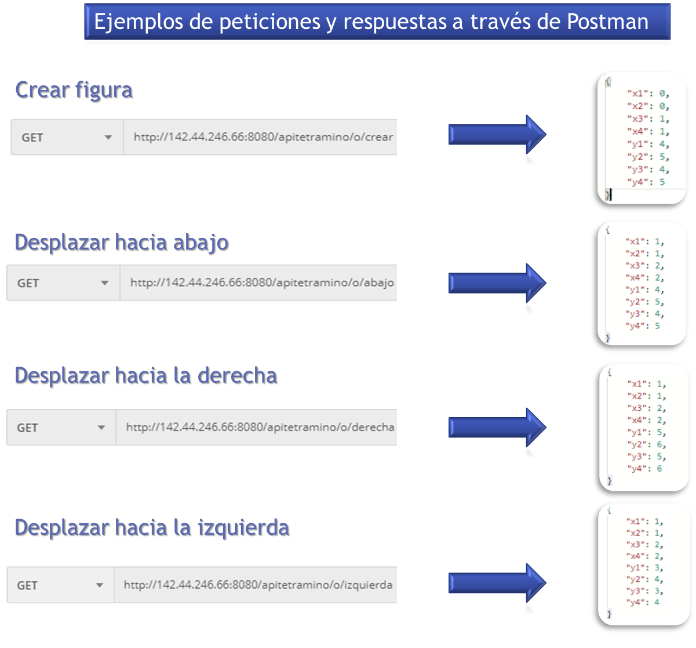
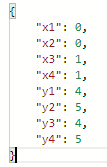
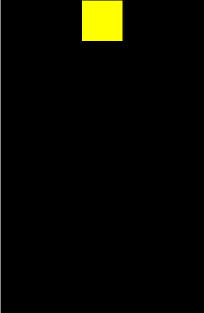

# Tetraminó letra O.

<p align="justify">
Esta es una API que permite simular el desplazamiento de la letra O en un tablero de tetris,
en las diferentes direcciones (abajo, derecha e izquierda). Esta letra puede ser empleada en
cualquier aplicación de tetris que quiera desarrollarse, el siguiente enlace le ofrece la
documentacion en Java sobre las clases, métodos parámetros y objetos que retornan: 
http://142.44.246.66:8080/tetraminoo/apidocs/index.html

Para enteder los datos retornados por la API, se deben entender cada una de las partes que
conforman el tetrimino O, de la siguiente manera:
</p>



## Uso

<p align="justify">
En esta sección se explicará desde la realización de la petición, hasta el uso del objeto 
con los valores retornados por el servidor, para representar la figura en cualquier tipo 
de interfaz que represente el area de juego.
</p>

### URL's para realizar petición al servidor (funciones de desplazamiento)

<p align="justify">
Para el uso de las operaciones de desplazamiento realizadas por el servidor en la aplicación de tetris, se
debe tener varias funciones o métodos dentro de la aplicación cliente que realicen las solicitudes al servidor, 
para esto se hace uso de siguiente URL:

http://142.44.246.66:8080/apitetramino/o/{funcion}

Esta URL se divide en las siguientes partes:

http://142.44.246.66:8080/apitetramino -> URL base.

/o -> ruta base para acceder a los servicios de la letra O

El término {funcion} puede ser reemplazado por cualquiera de las siguientes operaciones:

/crear -> operación para cargar la figura en la ubicacion inicial del tablero de juego.

/abajo -> operación para desplazar la figura hacia abajo en el tablero de juego.

/derecha -> operación para desplazar la figura hacia la derecha.

/izquierda -> operación para desplazar la figura hacia la izquierda.

***Ejemplos***

Realizar la petición que retornará la posición inicial de la figura:

http://142.44.246.66:8080/apitetramino/o/crear

Realizar la petición de desplazamiento hacia abajo:

http://142.44.246.66:8080/apitetramino/o/abajo
</p>

***Nota:***

<p align="justify">
Es importante que antes de hacer las peticiones a las funciones de desplazamiento se realice una petición a la 
URL para crear la figura y de esta manera obtenerla con las coordenadas iniciales, en los casos en que el 
seleccionador aleatorio del tablero elija esta letra o cuando haya terminado de desplazazarse y el seleccionador 
la elija nuevamente.

En el apartado de ***"Respuesta del servidor"*** se mostrará con más detalle la forma de realizar peticiones 
con esta URL mediante la herramienta Postman y la estructura que retorna como respuesta, también podrá ver las 
maneras de hacer la solicitud en código javascript con el uso de JQuery y Ajax en el apartado de y en una aplicación
Android ***Ejemplos de solicitud en aplicación web***, para este último lenguaje se darán links con más información en la 
sección de ***Referencias***.
</p>

### Herramienta para probar respuesta del servidor (Postman)

<p align="justify">
La siguiente imagen, muestra el entorno gráfico del cliente de servicios REST con el cual podrá hacer una peticion al
servidor y ver la data retornada que utilizará para mostrar la figura y simular el desplazamiento de esta en su aplicación.
</p>


<p align="justify">
En el entorno gráfico, puede elegir el tipo de solicitud HTTP que necesite realizar:
</p> 

<ul>
	<li>GET -> obtenención de datos, no es obligatorio el envío de parámetros.</li>
	<li>POST -> envío de datos, se requiere el envío de parámetros.</li>
	<li>PUT -> actualización de datos, requiere de envío de parámetros.</li>
	<li>DELETE -> Borrado de datos, no es obligatorio el envío de parámetros.</li>
</ul>

<p align="justify">
Para la comunicación con este servidor, todas las peticiones deben ser de tipo GET, ya que no se envía ningún parámetro 
para obtener la ubicación de las piezas que conforman la figura al obtenerse por primera vez o al desplazarse en las diferentes 
direcciones. Además de esto, los datos de respuesta se enviarán de manera agrupada en una estructura (esto se explicará con detalle en 
la siguiente sección), solo necesita digitar la url con el nombre de la operación como se explicó anteriormente.
</p>

### Respuesta del servidor

<p align="justify">
La respuesta retornada por el servidor (recurso), es un objeto de tipo JSON (Notacion de objetos Javascript, por sus
siglas en inglés), el cual contiene en su interior variables que almacenan las posiciones en X y Y de cada
pieza que conforma la figura, cada vez que la aplicación cliente (juego de tetris) realiza la petición para
realizar algún desplazamiento (presionando una tecla o seleccionando una opcion en la pantalla), el servidor retornará 
los valores de las coordenadas X y Y modificadas (filas y columnas si se toma como referencia una matriz), 
sumando o restando estas para simular el movimiento de la figura.

A continuación, encontrará una imagen que muestra la manera de probar las respuestas que genera el servidor con el
uso de la herremienta Postman y la respuesta generada a dicha petición.
</p>



***Notas:*** 

<p align="justify">
Las respuestas mostradas posiblemente no tengan los mismos valores, esto depende de la cantidad
de veces que su aplicación lance las peticiones de desplazamiento.

Un objeto puede verse como una estructura que en su interior puede contener diferentes tipos de datos 
(enteros, cadenas, caracteres, flotantes, listas de objetos, entre otros).
</p>

### Ejemplo de solicitud en aplicación web.

<p align="justify">
En esta sección se darán ejemplos de como realizar una peticion al servidor en una aplicacion web con el uso de javascript,
para el caso de una aplicación Android, se recomienda el uso de la librería retrofit2, el se compartirá un enlace sobre la
instalación y uso de esta en la sección de ***referencias***.

La manera más común de hacer una petición al servidor por medio de Javascript es con el uso de una técnica llamada Ajax,
hay dos formas de aplicar esta técnica: una con javascript puro y la otra conbinando este lenguaje con la librería JQuery,
esta permite reducir el código javascript.
</p>

***Uso de Ajax sin JQuery (estándar ES5)***


```javascript
	
	function crearTetramino() {

		var request = new XMLHttpRequest();
		
		request.onReadyStateChange() = function() {
		
			if(this.readyState == 4 && this.status == 200) {			// Si el código en el navegador es 200(OK) -> petición exitosa. 
				console.log(this.responseText);							//this.responseText = coordenadas de las piezas retornadas por el servidor
				obtenerUbicacionActual(this.responseText);				//Guardar datos retornados en otra variable.
				actualizarTablero(this.responseText);					//Actulizar el estado del tablero con datos retornados.
			}
		
		}
		
		request.open("GET", "http://localhost:8080/APIspring/api/tetramino/o/create", true);	//Crea peticion GET de manera asíncrona (true).
		request.setRequestHeader("Content-type", "application/json"); 							//Configuración para recibir objeto en formato JSON.
		request.send();																   			//Envía petición sin parámetros.
	
	}
```

***Uso de Ajax con JQuery (ES5 ó ES6)***

```javascript

	function crearTetramino() {

		$.ajax({

			url : "http://localhost:8080/APIspring/api/tetramino/o/create",
			type: "GET",
			contentType: "application/json", //Configuración para recibir objeto en formato JSON.
			success: function(data) {		 //data = ubicacion en X y Y de las piezas de la figura.
				console.log(data);			 //Imprimir ubicaciones de cada pieza retrnadas por servidor.
				obtenerUbicacion(data); 	 //Obtiene ubicación inicial.
				actualizarTablero(data);	 //Actualiza el estado del tablero con ubicación 
			},
			error: function(error) {														 //error = error retornado en caso de fallar la petición
				console.log(`Ha ocurrido un error: ${error.status}, ${error.statusText}`);   //Imprime código de error e informacíón de este en caso de fallar.
			}

		});
	
	}
```
<p align="justify">La librería JQuery se debe incluir en el archivo .html que deba hacer uso del script, de la siguiente manera:</p>

```html
	
	<!DOCTYPE html>
	<html lang="en">
	<head>
		<meta charset="UTF-8">
		<title>Prueba TetraminoO</title>
		<script src="js/jquery-3.2.1.js"></script>
	</head>
	<body>
		
	</body>
	</html>

```
<p align="justify">
Se compartirá un enlace para descargar esta librería en el apartado de ***Referencias*** en caso de que prefiera esta opción.
</p>

***Petición asíncrona con ES6 (uso de async y await - sin librerías)***

<p align="justify">
En el nuevo estándar de javascript (ES6), se puede hacer uso de las funciones ***async*** y ***await***.
</p>

```javascript

	async function crearTetramino() {

		try {
		
			const peticion = await fetch("http://localhost:8080/APIspring/api/tetramino/o/create");
			const respuesta = await peticion.json();
			
			console.log(respuesta);
			obtenerUbicacion(respuesta);
			actualizarTablero(respuesta);
		
		} catch(error) {
			
			console.log(`Ha ocurrido un error: ${error.status}, $(error.statusText)`);
			
		}
	
	}
```

***Nota:*** 

<p align="justify">
Las fuciones console.log(), obtenerTablero() y actualizarTablero() son ejemplos de operaciones que se pueden realizar en caso que 
la petición sea exitosa, esto depende de la lógica de programación de quien desarrolle la aplicación.

En la sección de referencias se darán links que explicarán la forma de consumir los servicios por medio de los lenguajes programación
Android y Java.
</p>

### Formas de representar los valores en diferentes interfaces (ejemplo de uso en tablero de tetris):

<p align="justify">
El objeto con las posiciones en X y Y de cada pieza de la figura, no solo es aplicable a una matriz que se muestra por
consola, también puede utilizarse para mostrar el movimiento de la figura en un elemento canvas o cuadricula de elementos div 
(en el caso de javascript y HTML), un JFrame o JPanel (Java) o cualquier interfaz para representar las piezas que conforman 
esta en una aplicación Android.

En el código fuente, encontrará un directorio llamado ***"prueba"***, dentro de este se tiene un archivo ***index.html*** que muestra una 
cuadricula hecha con elementos ***div***, este a su vez importa los archivos ***ajax.js*** que realiza las peticiones con ayuda de la 
librería JQuery y el archivo ***TetraminoO.js*** que muestra una manera de actualizar las celdas del tablero mediante asignacion en una 
matriz que se imprime en consola (presionar F12 en el archivo index.html) y la interfaz gráfica.
</p>

***Dato:***

<p align="justify">
La ventaja de aplicar cambios a la posición de las piezas en el tablero mediante asignación, es que este proceso no demanda tiempo de 
máquina dependiendo de la cantidad de datos que se ingresen como puede suceder con el uso de ciclos For, al momento de actualizar el 
tablero de juego varias veces, esto asegura de que el tablero de juego pueda actualizar su estado de manera rápida, teniendo en cuenta 
que los datos retornados en el objeto JSON son pequeños y no demandan mucho uso de memoria.

Para un area de desplazamiento representada en un canvas, donde se tiene una medida de referencia como píxeles, ems o rems, se puede
hacer una operacion matemática como una multiplicacion de cada valor por el tamaño que las piezas tendrían dentro de esta y luego sumar la
la distancia (píxeles, ems o rems) a la que debe desplazarse.
</p>

***Ejemplo:***

<p align="justify">
Se tiene un canvas de 400pt x 800pt, donde las dimensiones de cada pieza que conforma la figura mide 40px en todos sus lados.
y el objeto JSON retornado es el siguiente:
</p>



<p align="justify">
Para la mostrar la figura en su posicion inicial, se puede tomar el valor del primer punto de eje X y el primero del eje Y,
es decir, x1 = 0, y1 = 4 y tomar las dimensiones de la figura completa (80pt x 80pt), luego se realizaría, luego se realizarían
las operaciones para obtener el punto inicial de la figura O en X y en Y en del siguiente fragmento de código, por ultimo, 
se colocan estos valores calculados junto con el ancho y el alto de toda la figura en la función ***fillRect()*** del contexto canvas.
</p>

```html
	<!DOCTYPE html>
	<html lang="en">
	<head>
		<meta charset="UTF-8">
		<title>Prueba TetraminoO</title>
	</head>
	<body>
		
		<canvas id="canvas" width="400" heigth="800">
		</canvas>
		
	</body>
	</html>
```

```javascript
	const canvas = document.getElementById("canvas");		  		  //Obtener elemento canvas por su id.
	const ctx = canvas.getContext("2d");							  //Contexto del canvas 2d.

	function mostrarFigura(ubicacion) {								  //ubicacion = objeto con coordenadas retornado por el servidor.
	
		let ubicacionIniX = 40 * ubicacion.y1;						  //obtner punto inicial en eje X = 160.
		let ubicacionIniY = 40 * ubicacion.x1;		  				  //obtener inicial en eje Y = 0.
		
		ctx.fillStyle = "yellow";									  //Elegir color para pintar figura
		ctx.fillRect(ubicacionIniX,ubicacionIniY, 80, 80);   		  //Pintar un rectangulo de 80px * 80px desde su ubicacion inicial en eje X y Y.
	
	}
```
<p align="justify">
El resultado sería este:
</p>



<p align="justify">
Puede utilizar una variable temporal como en el caso de la variable ***"coordenadas"*** en el tablero de prueba adjunto, para modificar el
color los puntos pintados de anteriormente en tablero al momento de obtener otra respuesta en el objteo ***ubicación*** cuando se realice
otro desplazamiento de tal manera que simule el borrado en la parte del area de juego donde se encontraba antes la figura.

Tambien se puede llamar la misma funcion utilizando todos los puntos iniciales en X y Y para cada pieza repitiendo la funcion fillRect()
por la cantidad de piezas que tenga la figura con un ancho y un alto de 40pt x 40pt.
</p>

## Referencias

[Javadoc - API TetraminoO](http://142.44.246.66:8080/tetraminoo/apidocs/index.html)</br>
[Tablero de prueba Tetramino O](http://142.44.246.66:8080/Tablero_prueba_O/index.html)</br>
[Anotaciones Spring](http://javaconfigmx.blogspot.com/2018/03/entendiendo-las-anotaciones-de-spring.html) -> Entendiendo las anotaciones @Component, @Controller, @Service y @Repository en Spring -> bloc: Tópicos en Java MX (Marzo, 2018).</br>
[Herramienta Postman - descarga](https://www.postman.com/) -> Aplición postman de escritorio. Obtenida de sito oficial.</br>
[Introducción a AJAX](https://uniwebsidad.com/libros/ajax) -> Introducción, primeros pasos, librería JQuery, ejercicios... - Autor: Eguiluz, J (Junio, 2007).</br>
[JQuery - descarga](https://jquery.com/) -> Versión reciente de JQuery y documentación. Obtenido de sitio oficial.</br>

***Referencias sobre el nuevo estandar de javascript***</br>

[ES6 o ECMAScript 2015](https://desarrolloweb.com/articulos/que-es-ecmascript6-como-estudiarlo.html) -> Qué es ES6, también conocido como ECMAScript 2015, el más reciente estándar del popular lenguaje de programación Javascript.</br>
							-> Autor: Miguel Angel Alvarez.</br>
[Novedades de ES6](https://carlosazaustre.es/ecmascript6) -> Aprende ECMAScript 6 (ES6 o ES2015), el nuevo estándar de JavaScript - Autor: Zaustre, C (Octubre, 2018).  
[ES6 - parte1](https://www.youtube.com/watch?v=YNnE5FS79KQ) -> Video tutorial - FalconMasters.</br>
[ES6 - parte2](https://www.youtube.com/watch?v=KGjS6oTgOwQ) -> Video tutorial 2da parte - FalconMasters.</br>

***Links de consumo de servicios REST en Android y Java***</br>

[Retrofit](https://square.github.io/retrofit/) -> Librería para el consumo de servicios REST en Android, ejemplos de calls con peticiones HTTP.</br>
[Tutorial Retrofit](https://riptutorial.com/es/retrofit2) -> Propietario - RIP Tutorial.</br>
[Consumo API REST con Java](https://devs4j.com/2017/12/18/aprende-a-consumir-servicios-rest-via-https-leyendo-precios-de-criptomonedas/) -> DEVS4J - Aprende a consumir servicios REST vía HTTPS leyendo precios de criptomonedas.
